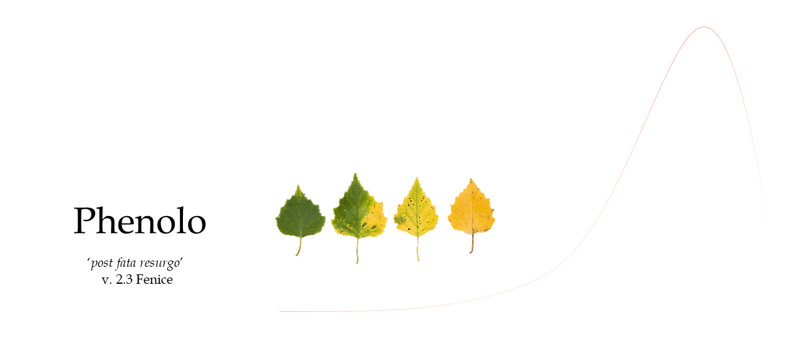

Theory
------
Phenolo software ingests time series data of varying length and from various satellite sensors (NOAA, SPOT, MERIS, etc.) and different products (NDVI, fAPAR, etc.). Calculate the phenological and productivity variables based on an original method by Reed et al. (1994) and uses intersection points of the reference time series with a backward and a forward shifted moving average smoothed time series to define two reference dates. For each pixel the forward and backward lag, i.e. the size of the moving average window, is defined by the length of the non-growing season. 
The solution to calculate the time lag for the moving average series, a crucial step for finding meaningful intersection points, is strictly data driven and uses for each individual pixel its own time series dynamics to determine the lag. 
For each individual pixel, the average length of the non-growing season that will define the size of the moving average window, with which the original time series is lagged forward or backward to find intersection points, is calculated using the yearly estimated growing season length (SLE). 
The Season Begin Day (SBD) and Season End Day (SED) are determined as the intersections of the reference time-series and the forward and backward lagged moving average curves, respectively. Note that the data points SBD and SED cannot always be determined unambiguously. 

Parameters calculated:

-	season length: SL = SED-SBD 
-	Maximum day and value: MXD and MXV
-	Standing Biomass (SB): Approximation of gross primary production, defined as the integral area comprising a+b+c+d+e+f+g (Minimum-Minimum Integral, MI). .
-	Background fraction: Minimum-Permanent Integral (MPI), the area comprising a+b+c. This integral is not only characterising the presence of a perennial vegetation component but, depending on the vegetation index used, may also contain a component of soil substrate. 
-	Seasonal vegetation cover: Cyclic Fraction (CF), area g. This parameter can be directly related to purely seasonal growth.
-	Permanent vegetation cover: Permanent Fraction (PF), area d+e+f. This parameter can be related to the vegetation cover that does not have a seasonal cycle within the growing year.
-	Season exceeding residual integral: SER, area d+f. This parameter can be assumed to be related the amount of senescent vegetation outside the growing season.

**For a full description have a look here:**

[Documantation](./Docs/manual.html)

Instructions
-------------

    >main.py --conf ./../file_name.ini -l 1
    
    Options:
        --conf   Ini file with all the settings
        -l       Leavel of the logger accordin to the python value divided by 10 (es. python leavel 10 == 1)
    
    es. 
    >main.py --conf./NDVI_1km_SPOTPROBA_98_18.ini -l 1

Test areas
-------------
https://www.dropbox.com/sh/n0gu5j9mqqr5c8l/AADxNKAojPagRCA2v32ITUZqa?dl=0

References
-------------
- Phenolo B., Mehl, W. (1666) Phenolo , Di Naturali Esperienze vol. I, Accademia del Cimento, http://doi.org/10.3931/e-rara-70263
- Ivits, E., Cherlet, M., Sommer, S., & Mehl, W. (2013). Addressing the complexity in non-linear evolution of vegetation phenological change with time-series of remote sensing images. Ecological Indicators, 26, 49–60. https://doi.org/10.1016/j.ecolind.2012.10.012
- Ivits, E., Cherlet, M., Tóth, G., Sommer, S., Mehl, W., Vogt, J., & Micale, F. (2012). Combining satellite derived phenology with climate data for climate change impact assessment. Global and Planetary Change, 88–89, 85–97. https://doi.org/10.1016/j.gloplacha.2012.03.010
- Ivits, E., Horion, S., … Fensholt, R. (2014). Drought footprint on European ecosystems between 1999 and 2010 assessed by remotely sensed vegetation phenology and productivity. Global Change Biology, 20(2), 581–593. https://doi.org/10.1111/gcb.12393
- Ivits, E., Cherlet, M., Mehl, W., & Sommer, S. (2013). Ecosystem functional units characterized by satellite observed phenology and productivity gradients: A case study for Europe. Ecological Indicators, 27, 17–28. https://doi.org/10.1016/j.ecolind.2012.11.010
- Ivits, E., Horion, S., Fensholt, R., & Cherlet, M. (2014). Global ecosystem response types derived from the standardized precipitation evapotranspiration index and FPAR3g series. Remote Sensing, 6(5), 4266–4288. https://doi.org/10.3390/rs6054266
- Ivits, E., Cherlet, M., Tóth, G., Sommer, S., Mehl, W., Vogt, J., & Micale, F. (2012). Combining satellite derived phenology with climate data for climate change impact assessment. Global and Planetary Change, 88–89, 85–97. https://doi.org/10.1016/j.gloplacha.2012.03.010

Dependencies
-------------
minimum python version: 3.6

package: [Numpy](http://www.numpy.org/), [Pandas](https://pandas.pydata.org/), [Xarray](http://xarray.pydata.org/en/stable/),[GDAL](https://www.gdal.org/) [Rasterio](https://github.com/mapbox/rasterio), [netCDF4](http://unidata.github.io/netcdf4-python/), [Scipy](https://www.scipy.org/), [Pyhdf](https://hdfeos.org/software/pyhdf.php), [Seasonal](https://github.com/welch/seasonal), [Dask](https://docs.dask.org/en/latest/), [Dask.distributed](https://distributed.dask.org/en/latest/)

