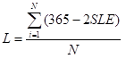
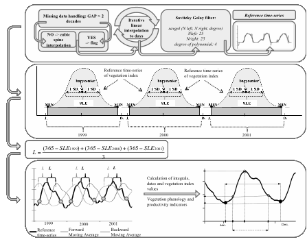
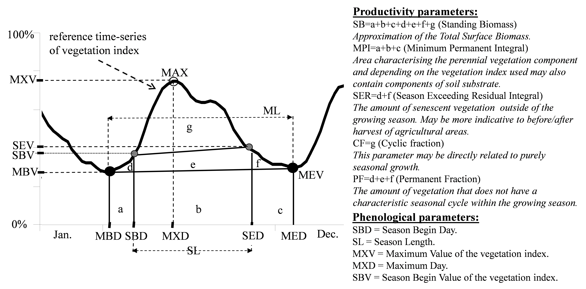

Theory
------
(1) The Phenolo software ingests time series data of varying length and from various satellite sensors (NOAA, SPOT, MERIS, etc.) and different products (NDVI, fAPAR, etc.). In order to render the calculated Phenolo variables comparable between the different satellite sensors, products and temporal ranges, the input data range is rescaled and values are reported according the interval 0%-100% ([V0, V1]). In case in the input dataset the 0 is projected to the value 0 the rescaling is straightforward and the output range is defined as V0=0 and V1=100 (i.e. [0,100]) in case of integer input values or V0=0 and V1=1 (i.e. [0,1]) in case of floating point values. In case in the input dataset 0 is not projected to the value 0 the data is rescaled accordingly where:

0 = V0 – value in the dataset which corresponds to 0 and 
1 = (V1 –Vmin)/(Vmax-Vmin). 
For instance, in case of an input dataset with a physical range of min=25 and max=275, V0 becomes
0 = V0-25 thus V0 = 25 whereas
1 = (V1-25)/(275-25) thus V1 = 275.

(2) Some time series have missing values and these gaps need to be substituted by acceptable values to obtain a continuous series to derive variables from. The GAP parameter, for which the Phenolo default is 2 decades, can be set according to the temporal resolution of the input time series. If the number of consecutively missing values in the time-series is less than the GAP parameter these values are replaced by values created through a cubic spline interpolation. Pixels with missing time steps in the input time-series larger than the GAP parameter are flagged to indicate that the calculated phenological variables are uncertain. Negative outliers in the time series, that might be indicative for e.g. cloud cover, are removed by substituting each sufficiently pronounced downward spike in the time-series data with the cubic interpolation through its four neighbors, if those neighbors are contiguous; if they aren't, the value remains untouched. The number of outliers to be removed can be set by the user as well as the threshold for the outlier identification and subsequent removal. This latter value is given in percentage in proportion to the input NDVI range (rescaled between 0 and 100, see before) and is calculated according to the following formula:

(out-vb)*(out-va)<t2,                                                                                             (Eq. 1)

where out is the value of the decade that is considered as outlier, vb is the value before the outlier data value, va is the value after the outlier data value and t is the value specified in percentage of the input range. Thus, in order to define a decade (or any other time-step) as an outlier, the t parameter to the power of two has to be larger than the product of the outlier value minus the time-series value before and the outlier value minus the time-series value after.

(3) In order to generate results comparable between data sources with different time aggregation windows, the next pre-processing step involves interpolation of the input time-series temporal resolution to daily values. Another step smoothes the series through a linear interpolation. Alternatively a spline interpolation can be chosen for the calculation of the daily values. For both methods the number of iterations can be set by the user. Subsequently, an iterative Savitzky-Golay filter with 4th polynomial degrees and a length of 50 days is applied to the time series in order to identify and remove short peaks and drop-offs due to noise as caused for instance by clouds. Both the window size and the degree of polynomials are parameters that can be adjusted according to best fit or need. These pre-processing steps (1-3) result in the reference time series on which the phenological variables are to be computed. 

(4) The methodology for calculating the phenological and productivity variables is based on an original method by Reed et al. (1994) and uses intersection points of the reference time series with a backward and a forward shifted moving average smoothed time series to define two reference dates. For each pixel the forward and backward lag, i.e. the size of the moving average window, is defined by the length of the non-growing season. Reed et al. (1994) determined a pre-defined lag time based on their a-priori knowledge on the average phenology of the study area. However, considering that all global continents have a diversity of climatic regions, a large variations of ecosystems, miscellaneous land covers and a range of land uses, such a-priori defined lag cannot account for such diversity. Equally, a pre-set threshold to indicate the reference date for seasonal dynamics, as commonly used e.g. in Timesat software, cannot account for such diversity either. For global application Phenolo needed to address the spatial and temporal specifics of a single pixel. Therefor the solution to calculate the time lag for the moving average series, a crucial step for finding meaningful intersection points, is strictly data driven and uses for each individual pixel its own time series dynamics to determine the lag. 

For each individual pixel, the average length of the non-growing season that will define the size of the moving average window, with which the original time series is lagged forward or backward to find intersection points, is calculated using the yearly estimated growing season length (SLE). This is derived from the pixel’s reference time-series by using two alternative methods (Figure 2). 

(a)	Between two subsequent NDVI signal minima, the signal above the line connecting the minimal values is interpreted as a histogram, mean and standard deviation of which are determined. The obtained mean value is effectively passing through the “barycentre” of the area, delimited by the NDVI signal and the baseline connecting the minima. By default, the SLE is defined to be two times the standard deviation computed from the barycentre of the area (expressed in days). Two standard deviations were taken as the default value for SLE because that describes 68.2% of the statistical population with normal distribution, which is considered a good approximation of vegetation productivity of the growing season. 
(b)	Alternatively, SLE is calculated as the side length of the quadrate, the area of which equals the area under the yearly vegetation index curve delimited by the two subsequent signal minima . 

The size of the moving average window, i.e. the lag, used to obtain the forward and backward shifted moving average filtered time series is then the yearly complement of SLE and is calculated as:

  

where L is the lag (in days), N is the number of years in the time-series, and 365 is the number of days in the year. 

In this way, the time series dynamics of each pixel is incorporated in the derivation of the phenological metrics in an objective and user independent way, allowing the algorithm to be applied under different climatic regions, land-use and ecosystems. Running the moving average in the forward direction (from the beginning to the end of the time series) results in a curve that lags behind the reference time-series whereas running the moving average filter backward creates a forward lagging curve. 

(5) The Season Begin Day (SBD) and Season End Day (SED) are determined as the intersections of the reference time-series and the forward and backward lagged moving average curves, respectively. Note that the data points SBD and SED cannot always be determined unambiguously. Determination fails when there is no significant seasonal variation, either due to extremely low vegetation density, or because the vegetation cover is not subject to seasonal variations. However, the failure to determine these points in itself allows deducing certain land cover characteristics. The intersections of the reference time-series and moving average curves might result in SBD values in the previous year and/or SED values in the next year. For the proper determination of these points in a given year the time-series should contain appropriate number of decades in the previous and in the next year. Once the SBD and SED data points are determined, a number of additional parameters can be computed which may allow to trace characteristics of the vegetation cover and their respective changes over time. Additional parameters comprise e.g. (see Figure 3):

-	season length: SL = SED-SBD 
-	Maximum day and value: MXD and MXV
-	Standing Biomass (SB): Approximation of gross primary production, defined as the integral area comprising a+b+c+d+e+f+g (Minimum-Minimum Integral, MI). .
-	Background fraction: Minimum-Permanent Integral (MPI), the area comprising a+b+c. This integral is not only characterising the presence of a perennial vegetation component but, depending on the vegetation index used, may also contain a component of soil substrate. 
-	Seasonal vegetation cover: Cyclic Fraction (CF), area g. This parameter can be directly related to purely seasonal growth.
-	Permanent vegetation cover: Permanent Fraction (PF), area d+e+f. This parameter can be related to the vegetation cover that does not have a seasonal cycle within the growing year.
-	Season exceeding residual integral: SER, area d+f. This parameter can be assumed to be related the amount of senescent vegetation outside the growing season.

References
-------------

Dependencies
-------------
minimum python version: 3.6

package: numpy, pandas, xarray, rasterio, netCDF4, scipy, pyhdf, seasonal, dask, dask.distributed
